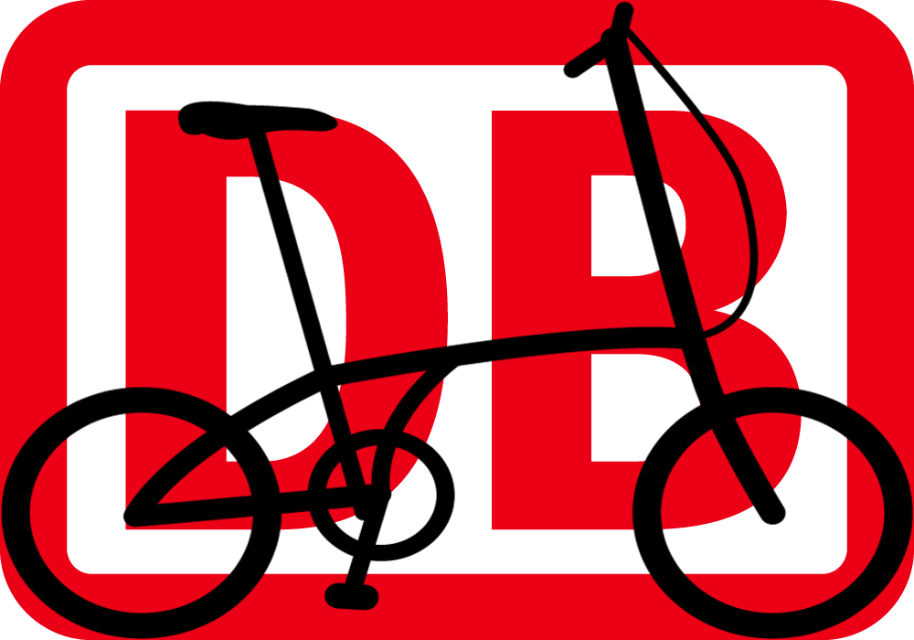
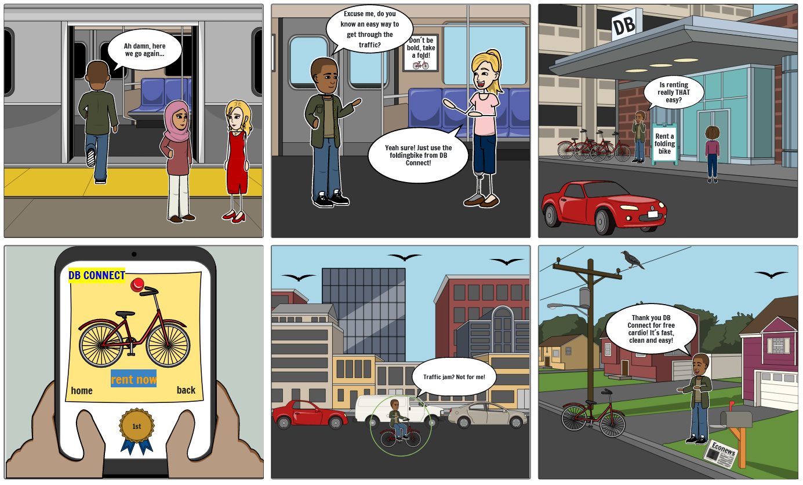

# gxc-team-3 
 

 
About Fold´n Go
 
Welcome to the Github Repository of Fold n go!
We are a international team of 6 ambitious and passionate students and want to have a positive impact on society:
Our vision ist to enable sustainable and healty last mile mobility for us and generations to come!

# Team Members

David Röhr     
Leonard Zimmermann     
Osenat Ogunlola     
Sabrina Pudil     
Tibor Berta      
Valentin Altemeyer      
 
 
# Our Journey
We created a solution for healthy, eco-friendly last-mile-traveling, using an innovation process to develop the solution, containing researching, ideating, prototyping and much more.
Especially conducting interviews with members of our target group helped us enormous to understand the pains and needs of them.

These pains and needs led us to our storyboard, featuring our idea.

# Storyboard

Please find further explanation to each step of the storyboard <a href="https://github.com/gxc-challenge-winter21/gxc-team-3/wiki/Storyboard"> here. </a>

# Prototype
Click on the following link to experience our prototype:

<a href="https://www.figma.com/proto/RL3zuIbUwJzg1KDtnXVQMk/Valentin-Altemeyer's-team-library?node-id=361%3A3&scaling=min-zoom&page-id=0%3A1&starting-point-node-id=361%3A3"> Fold ´n Go Prototype</a>

Make sure to check out our guide on how to use the prototype <a href="https://github.com/gxc-challenge-winter21/gxc-team-3/wiki/Sprint-2#how-to-use-the-prototype"> here. </a>

